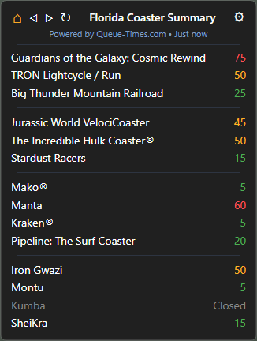
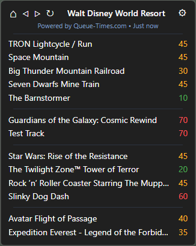

# Queue Panel

Queue Panel is a lightweight desktop tray application for monitoring theme park wait times using Queue-Times.com data.

Track individual parks, create custom ride lists, organize and reorder attractions, and keep your favorite rides only a click away from your desktop.

## Features

- Real-time ride wait times
- Multiple park support
- Favorite parks
- Favorite rides
- Custom ride lists
- Custom ride list dividers
- Ride list reordering
- Park filtering
- Ride filtering
- Park operating-hours tooltips
- Color-coded wait times
- Compact desktop tray integration
- Powered by Queue-Times.com data

## Screenshots

### Customized Organization for Single Parks (Epic Universe)

Organize attractions with custom dividers based on park, theme, ride type, manufacturer, or any category you choose.

### Custom Ride List for Multiple Parks (Walt Disney World Resort)

Create custom ride lists that combine attractions from multiple parks into a single dashboard for quick comparison.

## Installation

### Download Release

Download the latest installer from the GitHub Releases page and run the installer.

### Run from Source

Install dependencies:

npm install

Start the application:

npm start

### Build Executable

Create a distributable installer:

npm run dist

## Data Source

Queue Panel uses data provided by Queue-Times.com.

Powered by Queue-Times.com

https://queue-times.com

## Disclaimer

Queue Panel is an unofficial desktop companion application and is not affiliated with Queue-Times.com, Disney, Universal, SeaWorld, Six Flags, Cedar Fair, or any other theme park operator.

All ride wait-time data remains the property of its respective source.

## License

MIT License
