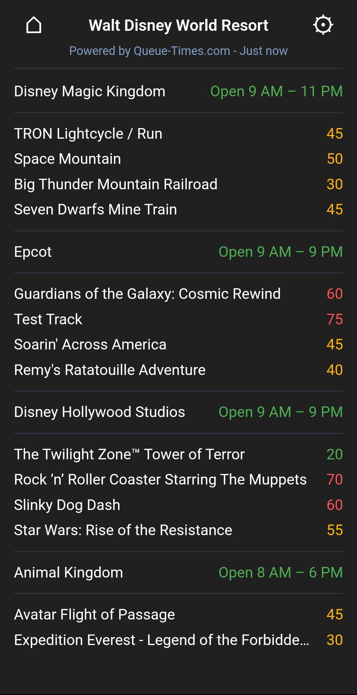
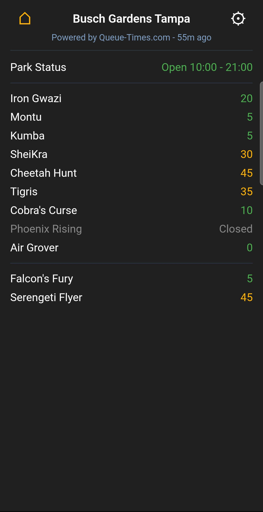
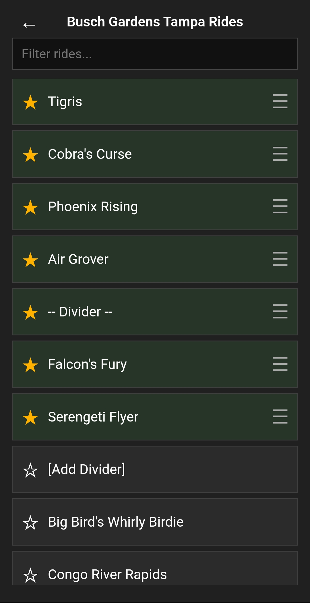
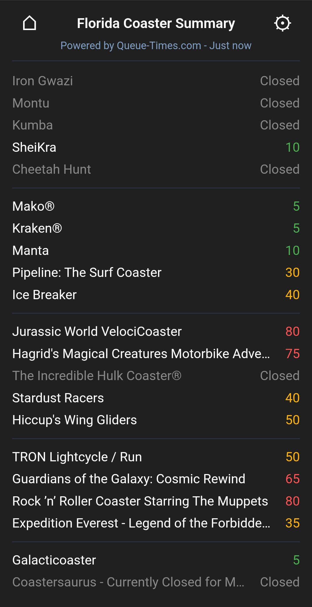
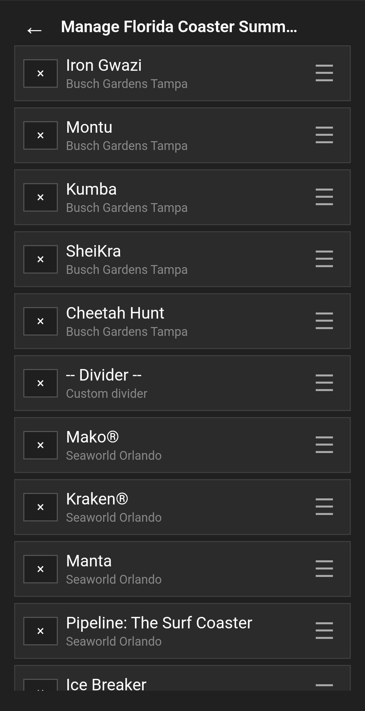

# Queue Panel

<p align="center">
  
</p>

Queue Panel is a lightweight application for monitoring live theme park wait times using Queue-Times.com data.

Whether you're planning your next theme park trip, checking wait times during your visit, or monitoring your favorite rides across multiple parks, Queue Panel provides a clean, customizable interface focused on the attractions that matter most to you.

Originally developed as a Windows desktop tray application, Queue Panel now includes a native Android app built from the same shared codebase, providing a consistent experience across desktop and mobile devices.

## Features

- View live ride wait times
- Show only your favorite parks
- Show only your favorite rides
- Reorder parks with drag and drop
- Reorder rides with drag and drop
- Build custom ride lists spanning multiple parks on a single screen
- Organize rides with custom dividers
- Quickly switch between favorite parks
- Set a home park for instant navigation
- View park operating hours
- Color-coded wait times for at-a-glance viewing
- No account required

## Screenshots

### Customized Organization for Single Parks (Busch Gardens Tampa)

<p align="center">
  
  
</p>

Organize attractions with custom dividers based on park, theme, ride type, manufacturer, or any category you choose.

### Custom Ride List Spanning Multiple Parks (Florida Coaster Summary)

<p align="center">
  
  
</p>

Create custom ride lists that combine attractions from multiple parks into a single dashboard for quick comparison.

## Installation

### Windows

Download the latest Windows installer from the GitHub Releases page.

Alternatively, build from source:

```bash
npm install
npm start
```

To build a distributable installer:

```bash
npm run dist
```

### Android

Queue Panel is available as a native Android application built with Capacitor.

**GitHub Releases**

Download the latest APK from the GitHub Releases page.

**Build from Source**

Install Java (JDK 17 or later), Android Studio, and project dependencies:

```bash
npm install
```

Sync the web assets:

```bash
npm run android:sync
```

Open the Android project:

```bash
npm run android:open
```

Build and run the app using Android Studio or Gradle.

## Data Source

Queue Panel uses live ride wait-time data provided by Queue-Times.com.

## Disclaimer

Queue Panel is not affiliated with Queue-Times.com, Disney, Universal, SeaWorld, Six Flags, Cedar Fair, or any other theme park operator.

Ride wait-time data remains the property of its respective source.

## License

MIT License
